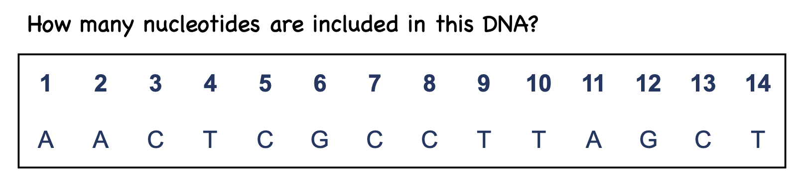

## R you ready for Molecular Biology?

**Learning objective:**

The session's goal is to understand how the stringr R package, extended by [tidyverse package](https://www.tidyverse.org/), can be used in a single DNA or RNA sequence. The course assumes prior tidyvers knowledge.

After the course, you will:

-   Understand and write `stringr`-based R code.

-   Analyse and simulate the Protein synthesis (Process from DNA to RNA).

The course is divided into two days in 2 hours. Each session is split into a few short topics and their practice. At the end of each session, you will receive an assignment. Your assignment should submit on time (you can find the exact deadline for each assignment in Brightspace).

The students are asked to **type on their keyboards the commands** being presented and observe effects (**avoid copy-paste**; own typing is important in order to learn how to respond to mistakes/errors)

Preparation: *Please install `tidyverse` and stringr packages.*

```{r}
#install.packages("tidyverse")
library(tidyverse)
```

\-\-\-\-\-\-\-\-\-\-\-\-\-\-\-\-\-\-\-\-\-\-\-\-\-\-\-\-\-\-\-\-\-\-\-\-\-\-\-\-\-\-\-\-\-\-\-\-\-\-\-\-\-\-\-\-\-\-\-\-\-\-\--

### **Introduction:**

So far, you have learned that R is mainly involved with **numbers**. There is a good reason for that: numbers are generally simpler to work with than text, and you cannot do too many things with them. Thus, they lend themselves well to examples that are easy to understand. In this session, we will work mainly with **Text** rather than Numbers. But why? The answer is that;

*As biologists, we are particularly interested in dealing with text rather than numbers.* *Specifically, we are interested in particular types of text that we call sequences -- the DNA and protein sequences that constitute the data we deal with in biology.*

You have learned (in the R-data science course) that computers consider numbers and text to be different in some way. String is the word we use to refer to a small amount of text in a computer program (it just means a string of characters). From this point on, we will use the word *string* when discussing computer code and reserve the word *sequence* when discussing biological sequences like DNA and protein.

**What are strings?**

Any value written within a pair of the single quote or double quotes in R is treated as a string. Internally, R stores every string within double quotes, even when you create them with a single quote.

This session will focus on the **`stringr`** package for string manipulation, which is part of the core tidyverse.

### **String basics**

You can create strings with either single quotes or double quotes. Unlike other programming languages, there is no difference in behavior.

If you forget to close a quote, you'll see [`+`](https://rdrr.io/r/base/Arithmetic.html), the continuation character.

```{r}
'This is a string with a closing quote'

```

Multiple strings are often stored in a character vector, which you can create with [`c()`](https://rdrr.io/r/base/c.html):

```{r}
 c("one", "two", "three")


```

### Storing strings in variables:

We can take a string and assign a name to it using an `=` or `<-` we call this a variable:

```{r}
# print variable
my_dna <- "ATGCGTA"
my_dna
```

The variable my_dna now points to the string "`ATGCGTA`." We call this assigning a variable, and once we have done it, we can use the variable name instead of the string itself.

In case we have more than one string, and you assign them to a variable name, you can retrieve them by using [] and writing the string numbers in the middle of the bracket. See the example below:

```{r}
stringExample <- c("one", "two", "three")
stringExample #check the string content
#Select the first part of string:
stringExample[1]
```

### Upper and Lower Case

You have a bunch of text, and all is a small letter. However, you want them in capital letter forms or vice versa. How can you do it by R?

You can use `toupper()` (small to a capital letter) & `tolower()` (capital to the small letter) in order to convert characters from upper to lower case or vice versa.

```{r}

DNA1 <- "atcg"
toupper(DNA1) # Convert to upper case letters

DNA2 <- "AATT"
tolower(DNA2) # Convert to lower case letters

```

### Concatenation strings `str_c()`

We can concatenate (stick together) two strings using the `str_c()`. This function will join together the strings.

```{r}
a <- "R you"
b <- "Ready"
c <- "for"
d <- "Molecular Biology"


str_c(a,b,c,d, sep = " ")
```

```{r}
stringExample <- c("one", "two", "three")
str_c(stringExample[1],stringExample[2],stringExample[3], sep = " ")
```

As you can see, there are some spaces between the First and Second DNA strings. str_c() concatenates strings (separating them by the string given by **`sep`**). You can change the separator by passing a sep argument.

```{r}
FirstDNA <- "AAGG"
SecondDNA <- "TTCC"
str_c(FirstDNA, SecondDNA, sep = "") # sep="", without any spaces
str_c(FirstDNA, SecondDNA, sep = ",") #sep=",", the comma make 
```

```{r}
my_dna <- str_c("AAGG","TTCC")
my_dna
```

We can even join multiple strings together in one go:

```{r}
#  Or if we are interested to assign the DNA string to a specific name
FirstDNA <- "AAGG"
SecondDNA <- "TTCC"
my_dna <- str_c(FirstDNA, "Exon", SecondDNA)
my_dna
# Now add a space as separator 
my_dna <- str_c(FirstDNA, "Exon", SecondDNA, sep = " ")
my_dna
```

#### **Exercise 1.a:**

There are Four genetic codons(3 nucleotides). Print them all together and with a semicolon (;) as a separator.

Codon1 \<- "ACG"

Codon2 \<- "CGU"

Codon3 \<- "UUG"

Codon4 \<- "CCG"

##### Solution1.a:

```{r, results='hide' ,class.source = 'fold-hide'}
Codon1 <- "ACG"

Codon2 <- "CGU"

Codon3 <- "UUG"

Codon4 <- "CCG"

str_c(Codon1, Codon2, Codon3, Codon4, sep = ";")
```

### Finding the length of a string (`str_length()` Function):



Measuring the nucleotide in DNA or RNA is critical in molecular biology. However, computers and specifically programming methods make life easier. We can use `str_length()` in this matter. `str_length()` is the fastest way to find out whether elements of a character vector are non-empty strings.

**Example:** How many nucleotides are in this DNA string?

```{r}
DNA <- "AACTCGCCTTAGCT"
# nchar(DNA)
str_length(DNA)
```

#### Exercise 1.b:

There is a sequence of DNA. This DNA string included how many nucleotides?

`ACAAGATGCCATTGTCCCCCGGCCTCCTGCTGCTGCTGCTCTCCGGGGCCACGGCCACCGCTGCCCTGCCCCTGGAGGG`

`TGGCCCCACCGGCCGAGACAGCGAGCATATGCAGGAAGCGGCAGGAATAAGGAAAAGCAGCCTCCTGACTTTCCTCGCT`

`TGGTGGTTTGAGTGGACCTCCCAGGCCAGTGCCGGGCCCCTCATAGGAGAGGAAGCTCGGGAGGTGGCCAGGCGGCAGG`

`AAGGCGCACCCCCCCAGCAATCCGCGCGCCGGGACAGAATGCCCTGCAGGAACTTCTTCTGGAAGACCTTCTCCTCCTG`

`CAAATAAAACCTCACCCATGAATGCTCACGCAAGTTTAATTACAGACCTGAA`

##### Solution 1.c:

```{r, results='hide' ,class.source = 'fold-hide'}
DNA <- "ACAAGATGCCATTGTCCCCCGGCCTCCTGCTGCTGCTGCTCTCCGGGGCCACGGCCACCGCTGCCCTGCCCCTGGAGGGTGGCCCCACCGGCCGAGACAGCGAGCATATGCAGGAAGCGGCAGGAATAAGGAAAAGCAGCCTCCTGACTTTCCTCGCTTGGTGGTTTGAGTGGACCTCCCAGGCCAGTGCCGGGCCCCTCATAGGAGAGGAAGCTCGGGAGGTGGCCAGGCGGCAGGAAGGCGCACCCCCCCAGCAATCCGCGCGCCGGGACAGAATGCCCTGCAGGAACTTCTTCTGGAAGACCTTCTCCTCCTGCAAATAAAACCTCACCCATGAATGCTCACGCAAGTTTAATTACAGACCTGAA"


str_length(DNA)
```

### **Count Number of Occurrences of Certain Character in String**

**Number of a pattern repetition.**

How we can check the number of specific nucleotide in a DNA or RNA seq?


You can use `str_count(string, pattern = " ")`

```{r}
exp <- "R You Ready For Molecular Biology?"
#Number of o in this sentence
str_count(exp, pattern = "o")

```

#### Exercise 1c:

Use the DNA from Exercise 1.b. This DNA string included how many A, U, G, and C?

How many nucleotides are in this DNA string? Write a program that will print out the proportion of A and T content of this DNA sequence.

##### Solution 1c:

```{r, results='hide' ,class.source = 'fold-hide'}

A_Counts <- str_count(DNA, "A")
A_Counts
T_Counts <- str_count(DNA, "T")
T_Counts
G_Counts <- str_count(DNA, "G")
G_Counts
C_Counts <- str_count(DNA, "C")
C_Counts
```

```{r, results='hide' ,class.source = 'fold-hide'}
total <- str_length(DNA)
str_c("Number of A in this DNA is", A_Counts)
str_c("Number of T in this DNA is", T_Counts)
# calculating the ratio of A and T in this DNA seq
(A_Counts + T_Counts)/total *100
```

### Replacement

Imagine we have a string and want to replace some parts with others. What can we do? `str_replace()` and `str_replace_all()`

`str_replace()` and `str_replace_all()` allow you to replace matches with new strings.

```{r}
Name <- "Nolecular Biologi and Nolecular Oncology"
# replace the first N with M
str_replace(Name, "N", "M")

# replace all N with M
str_replace_all(Name, "N", "M")

# let's save this replacement by some name 
New_Name <- str_replace(Name, "N", "B")
New_Name

# Now write a code print --> The name of new brand is "New_brand"
str_c("The name of new Name is: ", New_Name)

```


```{r}
DNA <- "AACTCGCCTTAGCT"
str_replace_all(DNA, "A", "T")
```

#### Exercise 1d:

You have a DNA string(exercise 1.c.). Write a program to be able to replace U with T.

### **Create complement DNA(cDNA)**

We all know:

In DNA, the nucleotides are deoxyribose sugars attached to a phosphate group and one of four nitrogen bases. The possible bases are:

-   Adenine (A)

-   Thymine (T)

-   Cytosine (C)

-   Guanine (G)

##### Solution 1d:

```{r, results='hide' ,class.source = 'fold-hide'}
str_replace_all(DNA, "T", "U")

```

**Complementary Sequence:** Since DNA has two strands, every DNA sequence has a complementary sequence running parallel. In the complementary sequence, Adenine (A) is always paired with Thymine (T), and Cytosine (C) is always paired with Guanine (G).

We have a small DNA sequence. Let's make DNA complement(cDNA):

```{r}
my_dna <- "ACTG"

# replace A with T
replacement1 <- str_replace_all(my_dna, "A", "T")
replacement2 <- str_replace_all(replacement1, "C", "G")
replacement3 <- str_replace_all(replacement2, "T", "A")
replacement4 <- str_replace_all(replacement3, "G", "C")
replacement4
```

Check the output. What do you think? Of course, the out put is wrong.

```{r}
dna <- "ACTG"
# replace A with T
replacement1 <- str_replace_all(my_dna, "A", "t")
replacement2 <- str_replace_all(replacement1, "C", "g")
replacement3 <- str_replace_all(replacement2, "T", "a")
replacement4 <- str_replace_all(replacement3, "G", "c")
replacement4
```

The `toupper()` function converts the small letter to a big letter.

```{r}
toupper(replacement4)
```

Or more easy way:

```{r}
dna <- "ACTG"
dna
dna <- str_replace_all(dna, c("A" = "t", "C" ="g", "G"= "c", "T"= "a"))
toupper(dna)
```
