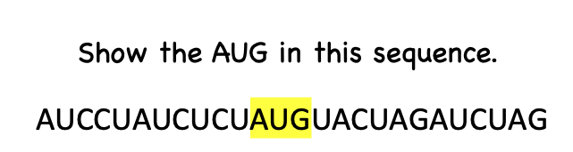
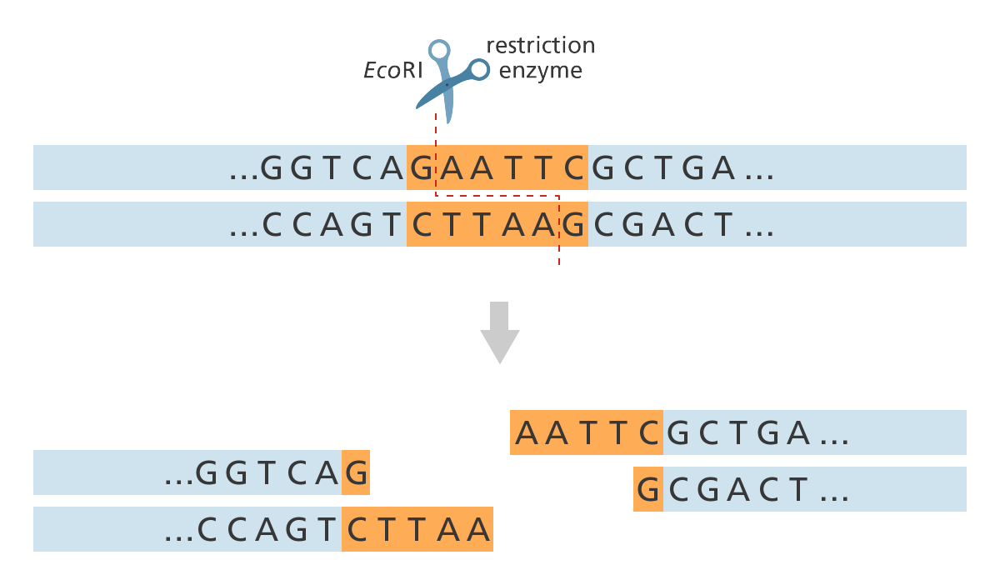
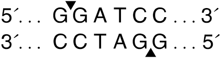
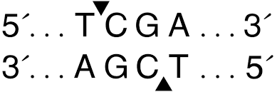
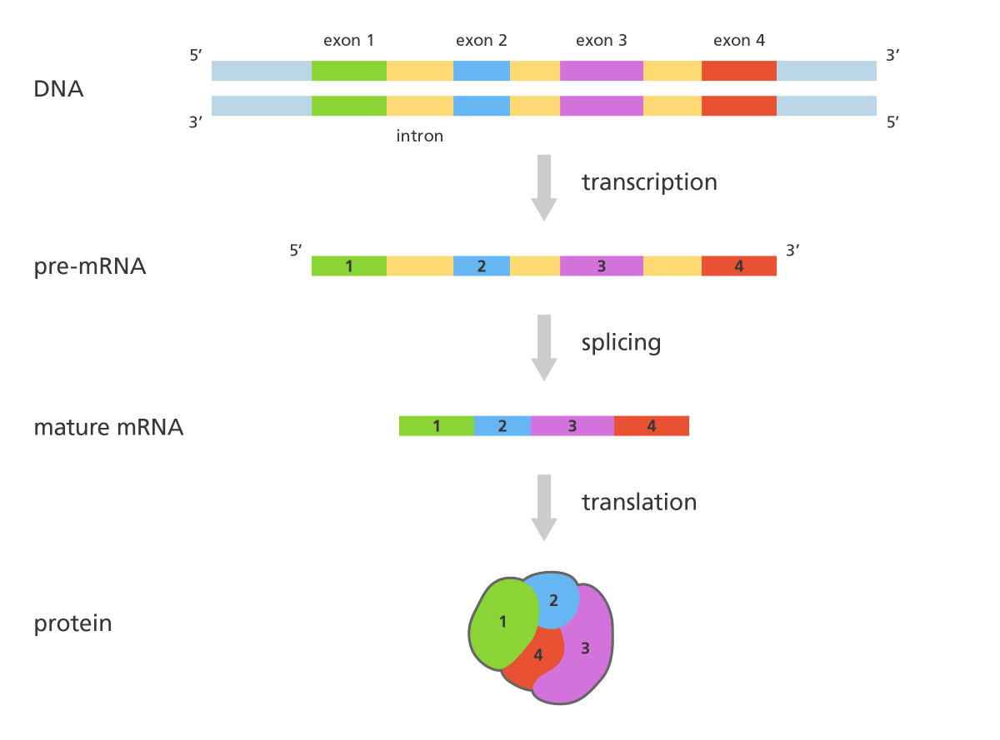

Preparation

```{r, message=FALSE}
#install.packages("tidyverse")
library(tidyverse)
library(stringr)
library(htmlwidgets)
```

# Introduction Day2

**So far, you have learned about the following:**

1.  *String basic*

2.  *Upper and Lower case*

3.  *Concatenation*

4.  *Counting the length of a string*

5.  *Count the Number of Occurrences of Certain Characters in a String*

6.  *Replacement*

    Now, you can

    -   **report the number of nucleotides in a sequence of DNA or RNA and calculate their proportion.**

    -   **Create a complementary DNA or RNA from a template**

In this session, you will learn the following:

1.  *View specific regions of a string*

2.  *Find the location of specific matches*

3.  *Splitting the string*

4.  *Selecting a particular position in a string*

    After this session, you will be able to:

    -   **Simulate the Restriction Enzyme function and calculate each length after fragmentation**

    -   **Simulate the RNA splicing process by selecting the coding RNA and creating spliced mRNA**

## View specific regions of a string

We have a string, and we want to detect and show the specific region of this string. How can we show the matches?



There are `str_view()` and `str_view_all()`, which are used to represent an area or pattern.

**`str_view`** shows the first match;

**`str_view_all`** shows all the matches.

```{r}
string_Example <- "Molecular Biology, Cellular Biology, Cellular Oncology, Molecular Oncology"

# Just show the first matches
str_view(string_Example, "Biology") 

# Show all the matches
str_view_all(string_Example, "Biology") 

str_view_all(string_Example, c("Biology", "Oncology")) 
```

**Example:** We have an mRNA string: `"AUCCUAUCUCUAGACUAGAUCUAG."` Write a program to show(highlight) all the `CU` and `AG` in this sequence. How many `CU` and `AG` are in this sequence?

```{r}
mRNA <-  "AUCCUAUCUCUAGACUAGAUCUAG"
str_view(mRNA, "CU")
str_view_all(mRNA, "CU")
```

Write a program to show all the `AG` in this string.

```{r}
mRNA <-  "AUCCUAUCUCUAGACUAGAUCUAG"
str_view_all(mRNA, "AG")
```

Now count how many `"AG"` and `"CU"` are in this string.

```{r}
mRNA <-  "AUCCUAUCUCUAGACUAGAUCUAG"
str_count(mRNA, "AG")
str_count(mRNA, "CU")
str_count(mRNA, c("AG", "CU"))
```

#### Exercise 2.a:

There are two strings of DNA. How many `ATGs` are in each sequence? Show them?

`ACATGTCATGTCC` and `CTTGTATGCTG`

##### Solution 2.a:

```{r, results='hide' ,class.source = 'fold-hide'}
sequences<-c("ACATGTCATGTCC","CTTGTATGCTG")
str_count(sequences, "ATG")
str_view_all(sequences, "ATG")
```

## Find the location of matches

Where is the location of `AGU` ?

Answer: start at 6 and end at 8.

{width="484"}

It is obvious that if we have long sequences, counting them is impossible. `str_locate_all()` to locate the position of patterns in a character string.

```{r}
RNA <- "AUCCUAGUACUAGU"
str_locate(RNA, "AGU") #Location of 1st AGU
str_locate_all(RNA , "AGU") #Location of all AGUs

str_locate_all(RNA , c("UAC","AGU")) #Location of all AGUs

```

#### Exercise 2.b:

We have three sequence of DNA:

`"ACTGATCGATTACGTATAGTAGAATTCTATCATACATATATATCGATGCGTTCAT"`

`"ACTTGAATTCTTCAGCTGAGATTCGG"`

`"ATCGGGTTAATACGTGAATTCAGGCTGATCGTGTAGCTTGGATCC"`

Write a program to locate the position of the EcorI (`GAATTC`) Restriction Enzyme Zone.

##### Solution 2.b:

```{r, results='hide' ,class.source = 'fold-hide'}
my_dna <- c("ACTGATCGATTACGTATAGTAGAATTCTATCATACATATATATCGATGCGTTCAT", "ACTTGAATTCTTCAGCTGAGATTCGG", "ATCGGGTTAATACGTGAATTCAGGCTGATCGTGTAGCTTGGATCC")
str_locate_all(my_dna, "GAATTC")
```

## Restriction Enzyme I

Restriction enzymes are found in **bacteria (and other prokaryotes)**. They recognize and bind to specific sequences of DNA, called restriction sites.

A restriction enzyme is a protein isolated from bacteria that cleaves DNA sequences at sequence-specific sites, producing DNA fragments with a known sequence at each end. The use of restriction enzymes is critical to specific laboratory methods, including recombinant DNA technology and genetic engineering.

Scientists use them **to cut DNA molecules at specific locations and then reattach different DNA sequences to each other** using an enzyme called DNA ligase, creating new, recombined DNA sequences or essentially new DNA molecules.

**EcorI (`G|AATTC`)**

{width="271"}

**BamHI (`GGATCC`)**

{width="225"}

**TaqI(`TCGA`)**

{width="235"}

So, how can we simulate the restriction enzyme in R? We first need to figure out how to split a string.

### Splitting

`str_split()` is used to split the elements of the specified character vector into substrings according to the given substring taken as its parameter. Here we are going to apply this function in string.

```{r}
Exp <- "Molecular Biology First Year Bachelor"

#split by space
str_split(Exp, pattern = " ")

#split by non-space
str_split(Exp, "")

#split by "space"o"
str_split(Exp,  "o")
```

As you find, we split the string into sub-string. However, how to work with each of the sub-strings? How to select the fragments after splitting?

```{r}
Example <- c("AB123CDE", "FG123HI")

Splitted <- str_split(Example, pattern = "123")

Splitted
```

{width="558"}

```{r}

#For the 1st fragment of 1st String
Splitted[[1]][1]

#For the 2nd fragment of 1st String
Splitted[[1]][2]

#For the 1st fragment of 2nd String
Splitted[[2]][1]

#For the 2nd fragment of 2nd String
Splitted[[2]][2]
```

#### Exercise 2.c:

There is a RNA string in below. Each three nucleotides are one codon and there a space in between codons. Write a program to split this strings to their codons.

Next, extract and assign each codon to a different name.

`AAC UCG UGG CCA GAC`

##### Solution 2.c:

```{r, results='hide' ,class.source = 'fold-hide'}

codons <- "AAC UCG UGG CCA GAC"
codons <- str_split(codons, pattern = " ")
codons
```

```{r, results='hide' ,class.source = 'fold-hide'}
cod1 <-codons[[1]][1]
cod1
cod2 <-codons[[1]][2]
cod2
cod3 <-codons[[1]][3]
cod3
cod4 <-codons[[1]][4]
cod4
cod5 <-codons[[1]][5]
cod5
```

### **Simulating restriction enzyme function by splitting method:**

We have DNA string:

`"ACTGATCGATTACGTATAGTAGAATTCTATCATACATATATATCGATGCGTTCAT"`

The restriction enzyme "`G`\|[`AATTC`]{.underline}".

Let's split (cut) the DNA by the RE and assign each length to different name.


*Please always check how many restriction enzyme sites exist in the fragment. `str_count()`*

```{r}
my_dna <- c( "ACTGATCGATTACGTATAGTAGAATTCTATCATACATATATATCGATGCGTTCAT")

str_count(my_dna, "GAATTC")

str_split(my_dna, pattern = "GAATTC")

```

Next, assign each length to different names and calculate the lengths of each sequence.

```{r}

# Extract 1st element
First_Length <- str_split(my_dna, pattern = "GAATTC")[[1]][1]            
First_Length
# Calculate 1st seq length
str_length(First_Length)

# Extract 2nd string and 1st element
Second_Length <- str_split(my_dna, pattern = "GAATTC")[[1]][2]            
Second_Length
# Calculate 2nd seq length
str_length(Second_Length)

```

### Counting the nucleotide after RE

Back and see the RE zone critically. In this example, RE cut the string in `G | AATTC`.

However, after splitting, we are missing `G` in the first sequence and `AATTC` in the second sequence!


So that is obvious that the number length is incorrect in the upper calculation.


```{r}
# Extract 1st element
First_Length <- str_split(my_dna, pattern = "GAATTC")[[1]][1]            
First_Length
# Calculate 1st seq length
str_length(First_Length) + 1 

# Extract 2nd string and 1st element
Second_Length <- str_split(my_dna, pattern = "GAATTC")[[1]][2]     
Second_Length
# Calculate 2nd seq length
str_length(Second_Length) + 5     
```

#### Exercise 2.d:

You have a DNA string. How many RE sites did you find? Write a program which able to simulate the EcorI `GAATTC` EcorI RE function. Show the fragments after the cutting by RE and report the length of each fragments.

`"ACTGATCGATTACGTATAGTAGAATTCTATCATACATTCGATGCGTTCATAC`

`TGATCGATTACGTATAGTAGAATTCTATCATACATATATATCGATGCGTTCAT"`

*Please always check how many restriction enzyme sites exist in the fragment. `str_count()`*

##### Solution 2.d:

```{r, results='hide' ,class.source = 'fold-hide'}
DNA <- "ACTGATCGATTACGTATAGTAGAATTCTATCATACATTCGATGCGTTCATACTGATCGATTACGTATAGTAGAATTCTATCATACATATATATCGATGCGTTCAT"

str_count(DNA, "GAATTC")

str_split(DNA, "GAATTC")[[1]][1]
FirstSeq <- str_length(str_split(DNA, "GAATTC")[[1]][1])+1
FirstSeq
str_split(DNA, "GAATTC")[[1]][2]
SecondSeq<- str_length(str_split(DNA, "GAATTC")[[1]][2]) + 6
SecondSeq
str_split(DNA, "GAATTC")[[1]][3]
ThirdSeq <- str_length(str_split(DNA, "GAATTC")[[1]][3]) + 5
ThirdSeq
```

#### Exercise 2.e:

There are Three sequences of DNA.

How many RE sites did you find? Write a program which able to simulate the EcorI GAATTC EcorI RE function. Show the fragments after the cutting by RE and report the length of each fragments.

Cut all DNA strings and calculate the length of DNA seq.

`"ACTGATCGATTACGTATAGTAGAATTCTATCATACATATATATCGATGCGTTCAT"`

`"ACTTGAATTCTTCAGCTGAGATTCGG"`

`"ATCGGGTTAATACGTGAATTCAGGCTGATCGTGTAGCTTGGATCC"`

*Please always check how many restriction enzyme sites are exist in the fragment. `str_count()`*

##### Solution 2.e:

```{r, results='hide' ,class.source = 'fold-hide'}
my_dna <- c("ACTGATCGATTACGTATAGTAGAATTCTATCATACATATATATCGATGCGTTCAT", 
            "ACTTGAATTCTTCAGCTGAGATTCGG", 
            "ATCGGGTTAATACGTGAATTCAGGCTGATCGTGTAGCTTGGATCC")

str_count(my_dna, "GAATTC") #Count number of RE in each string


#Split each DNA string
str_split(my_dna, "GAATTC")
##First DNA
#Split + count the 1st lenght in 1st DNA 
FirstStr_1stDNA <- str_length(str_split(my_dna, "GAATTC")[[1]][1])+1
FirstStr_1stDNA

#Split + count the 2nd lenght in 1st DNA 
ScondStr_1stDNA <- str_length(str_split(my_dna, "GAATTC")[[1]][2]) + 6
ScondStr_1stDNA


##Second DNA
#Split + count the 1st lenght in 2nd DNA 
FirstStr_2ndDNA <- str_length(str_split(my_dna, "GAATTC")[[2]][1])+1
FirstStr_2ndDNA
#Split + count the 2nd lenght in 2nd DNA 
ScondStr_1stDNA <- str_length(str_split(my_dna, "GAATTC")[[2]][2]) + 5
ScondStr_1stDNA


##Third DNA
#Split + count the 1st lenght in 3rd DNA 
FirstStr_3rdDNA <- str_length(str_split(my_dna, "GAATTC")[[3]][1])+1
FirstStr_3rdDNA
#Split + count the 2nd lenght in 3rd DNA 
ScondStr_3rdDNA <- str_length(str_split(my_dna, "GAATTC")[[3]][2]) + 5
ScondStr_3rdDNA
```

## Splicing

RNA splicing is a process in molecular biology where a newly-made precursor messenger RNA (pre-mRNA) transcript is transformed into a mature messenger RNA (mRNA). It works by removing all the introns (non-coding regions of RNA) and splicing them back together exons (coding regions).

{width="526"}

## Select certain position of string

**`str_sub()`**

Let's consider that we have a string of RNA, and we would select a specific position of this string. `str_sub()` helps to select a particular position by choosing the start and end points of the string.

For example, we have a string of numbers from 1 to 9, and we are interested in selecting 4 to 8.

```{r}
Sample <- "123456789"
str_sub(Sample, 4, 8)
```

If you interested to select from number 4 until the end you can follow:

```{r}
str_sub(Sample, 4)

```

In a RNA string we would like to check what's included in position 5-8. So;

```{r}
DNA_sample <- "AUCGCGUAGCGA"
Selected_String  <- str_sub(DNA_sample, 5, 8)
Selected_String
```

### Exercise 2.f:

There is a string of DNA. We are interested in selecting locations 9-15 and 22-30. After selecting them, create a new string which include these two selected strings.

`ACTGATCGATTACGTATAGTATTTGCTATCATACATATATATCGATGCGTTCAT`

##### Solution 2.f

```{r, results='hide' ,class.source = 'fold-hide'}

DNA<- "ACTGATCGATTACGTATAGTATTTGCTATCATACATATATATCGATGCGTTCAT"
A <- str_sub(DNA, 9, 15)
B <- str_sub(DNA, 22, 30)

A
B
str_c(A, B)
```

## Removing

Remove matched patterns in a character string with `str_remove()` and `str_remove_all()`.

Example:

The DNA string: `ATCAAATCGATAGCTA`. How to remove the `TCG` from the string?

```{r}
DNA <- "ATCAAATCGATAGCTCGTA"
DNA

#Lenght of DNA2?
str_length(DNA)

#How many "TCG" are in this DNA?
str_count(DNA, "TCG")

#Show all the "TCG"
str_view_all(DNA, "TCG")

#Remove the fist "TCG"
Remove1 <- str_remove(DNA, "TCG")
#Show the DNA after removing
str_view_all(Remove1, "TCG")

```

As you can see, there are two times `TCG` in this string. However, `str_remove()` only removed the first match. For removing all the matches, we can use `str_remove_all()`.

```{r}

#Remove all the "TCG"
Remove_all <- str_remove_all(DNA, "TCG")
#Show all the "TCG"
str_view_all(Remove_all, "TCG")

#Show the DNA after removing
Remove_all

##Lenght of DNA after "TCG" removing
str_length(Remove_all)

```
