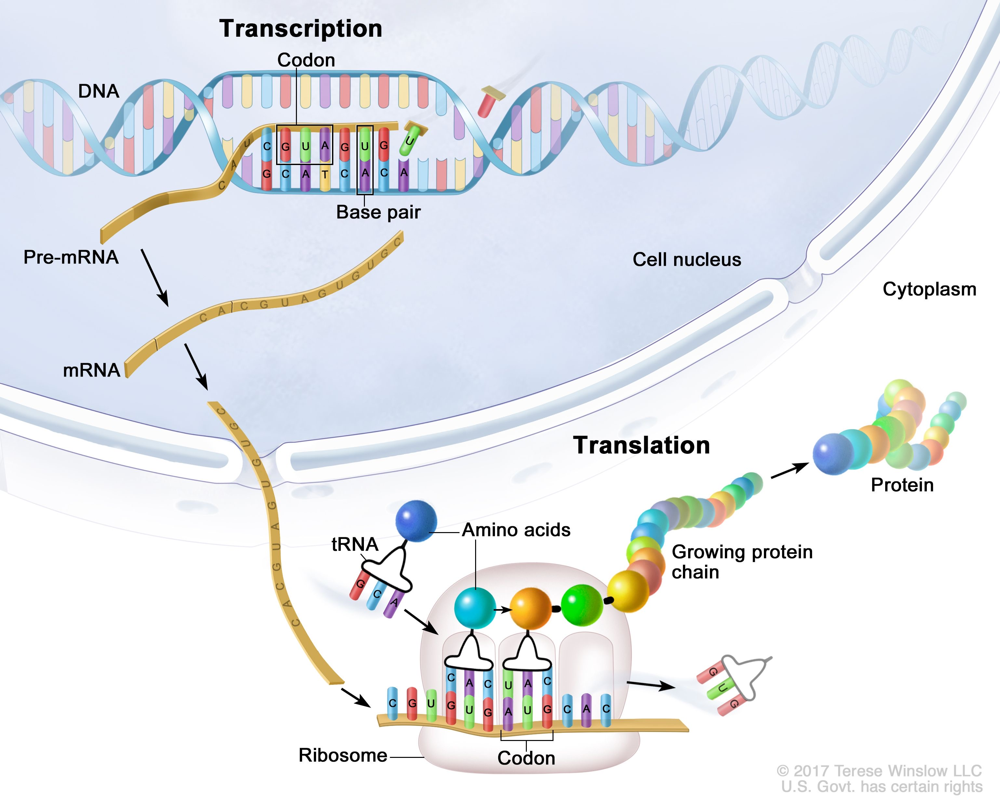

Preparation: Please install `tidyverse` and `stringr` library before start.

```{r, message=FALSE}
#install.packages("tidyverse")
library(tidyverse)
library(stringr)
library(htmlwidgets)
```

The DNA or RNA string for each question are also available in a separate text file in Brightspace entitled **Day3_Strings_Test.**

## Q1: Splicing out introns

Here's a short section of genomic DNA:

`ATCGATCGATCGATCGACTGACTAGTCATAGCTATGCATGTAGCTACTCGATCGATCGATCGATCGATCGATCGATCGA`

`TCGATCATGCTATCATCGATCGATATCGATGCATCGACTACTAT`

It comprises two exons and an intron. The first exon runs from the start of the sequence to the 50 character, and the second exon runs from the 73 character to 95 of the sequence.

Write a program that will calculate what percentage of the DNA sequence is coding.

```{r}
#dna <- ....

```

## Q2: Splicing out introns

Using the data from part one and, write a program that will print out the original genomic DNA sequence with coding bases(Exons) in uppercase and non-coding bases(Introns) in lowercase.

hint: you can use `tolower()` function in order to have bases in lowercase.

`ATCGATCGATCGATCGACTGACTAGTCATAGCTATGCATGTAGCTACTCGATCGATCGATCGATCGATCGATCGATCGA`

`TCGATCATGCTATCATCGATCGATATCGATGCATCGACTACTAT`

```{r}

```

## Q3:

{width="486"}

There is a DNA string.

DNA:

`AACTTACTTCCTAGGATGCTGATGCAGGTTCACATGCTGAAACTCCGGATAGGATGGACTATGGCTAGATATATAGCTAGCTAGCTAGGATTATATAGCTAGCTAGCTGACTAGCTAGAGATGGATC`

Write a program that will

1.  **Create the complement of this DNA sequence. (cDNA)**

2.  **Calculate CG content in cDNA in percentage**

3.  **Transcribe the cDNA to RNA. (Note A =\> U, C =\> G, U =\> A, G =\> C)**

4.  **Splicing process. (RNA to spliced-RNA)**

    *The first exon runs from the start of the sequence to the 40 character, and the second exon runs from the 89 character to 127 of the sequence. Write a program that will print just the coding regions(Exons) of the RNA sequence.*

5.  **Write a program that will calculate what percentage of the RNA sequence is coding(***Exons***).**

6.  **Create tRNA from Spliced-mRNA. (The complement of the Spliced mRNA)**

7.  **Detect all the start and stop codons and replace with `met` and `stop` respectively**:

    **Find the start codon (`AUG)` and [replace]{.underline} it with `met`.**

    **Find the stop codon (`UAG)` and [replace]{.underline} it with `STOP`.**

```{r}

```
