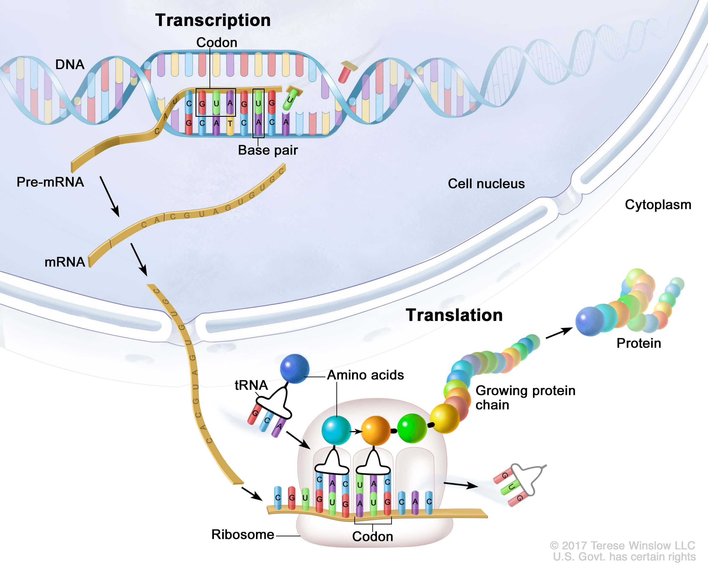

Preparation: Please install `tidyverse` and `stringr` library before start.

```{r, results='hide',include=FALSE, class.source = "fold-show"}
#install.packages("tidyverse")
library(tidyverse)
library(stringr)
```

The DNA or RNA string for each question are also available in a separate text file in Brightspace entitled **Day3_Strings_Test.**

## Q1: Splicing out introns

Here's a short section of genomic DNA:

"ATCGATCGATCGATCGACTGACTAGTCATAGCTATGCATGTAGCTACTCGATCGATCGATCGATCGATCGATCGATCGATCGATCATGCTATCATCGATCGATATCGATGCATCGACTACTAT"

It comprises two exons and an intron. The first exon runs from the start of the sequence to the 50 character, and the second exon runs from the 73 character to 95 of the sequence.

Write a program that will calculate what percentage of the DNA sequence is [coding]{.underline}.

-   Calculate the length of each exons

-   Calculate the length of DNA

-   Calculate the Coding DNA (percentage)

### Solution 1:

```{r, results='hide' ,class.source = 'fold-hide'}

my_dna <- "ATCGATCGATCGATCGACTGACTAGTCATAGCTATGCATGTAGCTACTCGATCGATCGATCGATCGATCGATCGATCGATCGATCATGCTATCATCGATCGATATCGATGCATCGACTACTAT"

total_length<- str_length(my_dna)
total_length
exon1 <- str_sub(my_dna, 1, 50)   
exon2 <- str_sub(my_dna, 73, 95)

coding_length_exon1 <- str_length(exon1)
coding_length_exon2 <- str_length(exon2)
coding_length <- coding_length_exon1 + coding_length_exon2
coding_length
total_length

str_c(coding_length/total_length*100)
```

## Q2: Splicing out introns

Using the data from part Q1 and, write a program that will print out the original genomic DNA sequence with coding bases(Exons) in uppercase and non-coding bases(Introns) in lowercase.

hint: you can use `tolower()` function in order to have bases in lowercase.

"ATCGATCGATCGATCGACTGACTAGTCATAGCTATGCATGTAGCTACTCGATCGATCGATCGATCGATCGATCGATCGATCGATCATGCTATCATCGATCGATATCGATGCATCGACTACTAT"

### Solution 2:

```{r, results='hide' ,class.source = 'fold-hide'}
my_dna <-"ATCGATCGATCGATCGACTGACTAGTCATAGCTATGCATGTAGCTACTCGATCGATCGATCGATCGATCGATCGATCGATCGATCATGCTATCATCGATCGATATCGATGCATCGACTACTAT"

total_length<- str_length(my_dna)
total_length
exon1 <- str_sub(my_dna, 1, 63)   
intron <- str_sub(my_dna, 64,90)
exon2 <- str_sub(my_dna, 91, 123)

str_c(exon1,tolower(intron) ,exon2, sep= "")
```

## Q3: From DNA to Amino Acid

{width="486"}

There is a DNA string.

DNA:

"AACTTACTTCCTAGGATGCTGATGCAGGTTCACATGCTGAAACTCCGGATAGGATGGACTATGGCTAGATATATAGCTAGCTAGCTAGGATTATATAGCTAGCTAGCTGACTAGCTAGAGATGGATC"

Write a program that will

1.  **Create the complement of this DNA sequence. (**cDNA**)**

2.  **Calculate CG content in cDNA in [percentage]{.underline}.** *(Amount of C + Amount of G)*

3.  **Transcribe the cDNA to RNA. (***Note: A -\> U, C -\> G, U -\> A, G -\> C* **)**

4.  **Splicing process. (RNA to spliced-RNA)**

    *The first exon runs from the start of the sequence to the 40 character, and the second exon runs from the 89 character to 127 of the sequence. Write a program that will print just the coding regions(Exons) of the RNA sequence.*

    **Create the RNA which only include of Exons(without Introns)**

5.  **Write a program that will calculate what percentage of the RNA sequence is coding** *(Length of Spliced RNA)***.**

6.  **Create tRNA from Spliced-mRNA. (The complement of the Spliced mRNA)**

7.  **Detect all the start and stop codons and replace with `met` and `stop` respectively**:

    **Find the start codon (`AUG)` and [replace]{.underline} it with `met`.**

    **Find the stop codon (`UAG)` and [replace]{.underline} it with `STOP`.**

### Solution 3:

1.  **DNA to cDNA**

```{r, results='hide' ,class.source = 'fold-hide'}
my_dna <-"AACTTACTTCCTAGGATGCTGATGCAGGTTCACATGCTGAAACTCCGGATAGGATGGACTATGGCTAGATATATAGCTAGCTAGCTAGGATTATATAGCTAGCTAGCTGACTAGCTAGAGATGGATC"
my_dna <- str_replace_all(my_dna, c("A" = "t", "C" ="g", "G"= "c", "T"= "a"))
toupper(my_dna)
DNA_complement <- toupper(my_dna)
```

2.  **CG content**

```{r, results='hide' ,class.source = 'fold-hide'}

C_Counts <- str_count(DNA_complement, "C")
G_Counts <- str_count(DNA_complement, "G")
total <- str_length(DNA_complement)
str_c("Number of C in this DNA is", C_Counts)
str_c("Number of G in this DNA is", G_Counts)
# calculating the ratio of C and G in this DNA seq
(C_Counts + G_Counts)/total *100

```

3.  **cDNA to RNA**

```{r, results='hide' ,class.source = 'fold-hide'}

RNA <- str_replace_all(DNA_complement, c("A" = "u", "C" ="g", "G"= "c", "T"= "a"))
toupper(RNA)
RNA <- toupper(RNA)
```

4.  **Splicing out introns**

```{r, results='hide' ,class.source = 'fold-hide'}
RNA_count<- str_length(RNA)
RNA_count
exon1 <- substr(RNA, start = 1, stop =  40)   
exon2 <- substr(RNA, start = 89,stop = 127)

str_c(exon1, exon2, sep= "")

Spliced_RNA <- str_c(exon1, exon2, sep= "")

Length_Spliced_RNA <- str_length(Spliced_RNA)
Length_Spliced_RNA

```

5.  **Coding length**

```{r, results='hide' ,class.source = 'fold-hide'}

print(Length_Spliced_RNA/RNA_count*100)

```

6.  **Create the complement of the mRNA which called tRNA**

mRNA to tRNA

```{r, results='hide' ,class.source = 'fold-hide'}
Spliced_RNA
tRNA <- str_replace_all(Spliced_RNA, c("A" = "u", "C" ="g", "G"= "c", "U"= "a"))
toupper(tRNA)
tRNA <- toupper(tRNA)
```

7.  **find the start and stop codons (AUG and UAG) and replace the name.**

Different Solutions:

```{r, results='hide' ,class.source = 'fold-hide'}
StartCodon <- str_replace_all(tRNA, "AUG", "met")
StartCodon
str_view_all(StartCodon, "met")

StopCodon <- str_replace_all(tRNA, "UAG", "STOP")
StopCodon
str_view_all(StopCodon, "STOP")


```

Or

```{r, results='hide' ,class.source = 'fold-hide'}
StartCodon <- str_replace_all(tRNA, "AUG", "met")
StartCodon

Stop_Start_codon <- str_replace_all(StartCodon, "UAG", "stop")
Stop_Start_codon

```

Or

```{r, results='hide' ,class.source = 'fold-hide'}
Check <- str_replace_all(tRNA, c("AUG"= "met", "UAG" = "stop"))
str_view_all(Check, c("met", "stop" ))
```
